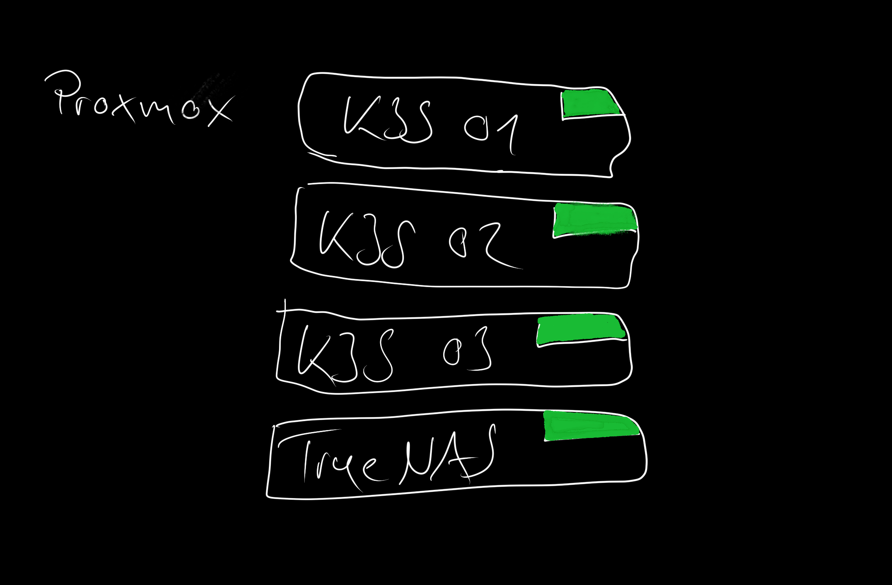
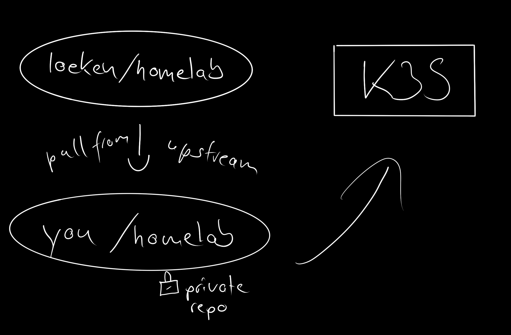

# homelab

## 1. index

- [homelab](#homelab)
  - [1. index](#1-index)
  - [1.2. note about old version](#12-note-about-old-version)
  - [1.3. goals](#13-goals)
  - [1.4. motivation](#14-motivation)
  - [1.5. the hardware](#15-the-hardware)
  - [2. proxmox installation](#2-proxmox-installation)
  - [2. fork this repo](#2-fork-this-repo)
    - [2.1. create a new private repo](#21-create-a-new-private-repo)
    - [2.2 push changes from loeken/homelab to private repo](#22-push-changes-from-loekenhomelab-to-private-repo)
    - [2.3. configure upstream](#23-configure-upstream)
    - [2.4 how to pull changes from "upstream"](#24-how-to-pull-changes-from-upstream)
    - [2.5. create a deploy key, add it to the github repository, so argocd can pull from the private repo](#25-create-a-deploy-key-add-it-to-the-github-repository-so-argocd-can-pull-from-the-private-repo)
  - [3. creating debian 11 template](#3-creating-debian-11-template)
  - [4. bootstrapping kubernetes](#4-bootstrapping-kubernetes)
    - [4.1. argocd sync bootstrap-core-app of apps](#41-argocd-sync-bootstrap-core-app-of-apps)

## 1.2. note about old version
argocd doesnt allow mounting secrets to the repo server anymore. re-created the project - started from scratc

## 1.3. goals
- full disk encryption of proxmox hypervisor
- all secrets used in helm charts exist in secrets and are encrypted using kubeseal

## 1.4. motivation
I've recently changed from an android phone to a second hand iphone se 2020. At the same time i started to renovate my flat ( smart home aspects ). These 2 events ( and a few other smaller events ) made me want to claim ownership of my own data, migrate away from services such as google, apple and the clouds - ideally without losing the convenience it gives me. I used to run a homeserver with proxmox managed by ansible playbooks before - but since its 2022 and kubernetes is a thing i wanted to use kubernetes for this project. I also want this stuff to be "secure".

## 1.5. the hardware
I see a lot of ppl attempting to run their homelab in high availability - i dont really plan to run any "critical applications", these i would run in the clouds. I ll by running the entire stack on a single server ( that happens to have a bunch of disks ), we ll be running 4 vms in proxmox, 3 that form a k3s cluster and 1 that provides storage ( truenas ). If you want to attempt to run it in ha you can run the 3 k3s nodes on 3 seperated hardware, provide a redundant truenas and off you go...


## 2. proxmox installation
proxmox installation is quite forward. I ll be installing debian 11 with full disk encryption on a single ssd ( feel free to go redundant here ). and then i ll update the debian 11 to become a proxmox ve7 host ( the proxmox installer doesnt come with a convenient way to do full disk encryption).

As for storage I have a 4Unit server with 24hdd slots with a HBA - since this is PCI device i ll simply pass this pci device with all disks to the truenas instance. if you dont have a similar device you can still pass in storage from the disks to the truenas vm using proxmox.

I also do use proxmox to configure simple firewall rules on the hosts - but that is pretty much it. Once proxmox is running we can start using this repository to create vms etc.

## 2. fork this repo

This allows you to pull the changes that i make to my setup from github.com/loeken/homelab, send to your repo and thus apply the changes to your cluster

### 2.1. create a new private repo
head to github, if you haven't done so yet create an account, then create a new homelab in this example i ll call it github.com/loeken/homelab-private

also make sure your ssh pubkey is added in github as we'll be pulling a private repo and auth via ssh keys.

the principles of cloning the public repo to a private are outlined here: https://docs.github.com/en/repositories/creating-and-managing-repositories/duplicating-a-repository


```
# ~/Projects/private is the project root where i clone private projects to
cd ~/Projects/private
git clone --bare git@github.com:loeken/homelab
Cloning into bare repository 'homelab.git'...
remote: Enumerating objects: 30, done.
remote: Counting objects: 100% (30/30), done.
remote: Compressing objects: 100% (20/20), done.
remote: Total 30 (delta 5), reused 27 (delta 5), pack-reused 0
Receiving objects: 100% (30/30), 8.89 KiB | 8.89 MiB/s, done.
Resolving deltas: 100% (5/5), done.
```

### 2.2 push changes from loeken/homelab to private repo
now we cd into the homelab.git folder to then push the changes to our newly created private repo
```
cd homelab.git
git push --mirror git@github.com:loeken/homelab-private
```

### 2.3. configure upstream
we now clone our own private repo and add the public repo as an upstream, this allows you to pull all the changes that i send to github.com/loeken/homelab
```
cd ~/Projects/private
git clone git@github.com:loeken/homelab-private
cd homelab-private
git remote add upstream https://github.com/loeken/homelab.git
```

### 2.4 how to pull changes from "upstream"
```
git pull upstream main
remote: Enumerating objects: 6, done.
remote: Counting objects: 100% (6/6), done.
remote: Compressing objects: 100% (2/2), done.
remote: Total 5 (delta 1), reused 5 (delta 1), pack-reused 0
Unpacking objects: 100% (5/5), 240.62 KiB | 2.62 MiB/s, done.
From https://github.com/loeken/homelab
 * branch            main       -> FETCH_HEAD
 * [new branch]      main       -> upstream/main
Updating c189a8d..cdbc04e
Fast-forward
 docs/img/proxmox-vms.png | Bin 0 -> 286445 bytes
 1 file changed, 0 insertions(+), 0 deletions(-)
 create mode 100644 docs/img/proxmox-vms.png
```

you may get a warning if you havent defined a pull strategy yet:
```
hint: You have divergent branches and need to specify how to reconcile them.
hint: You can do so by running one of the following commands sometime before
hint: your next pull:
hint: 
hint:   git config pull.rebase false  # merge
hint:   git config pull.rebase true   # rebase
hint:   git config pull.ff only       # fast-forward only
hint: 
hint: You can replace "git config" with "git config --global" to set a default
hint: preference for all repositories. You can also pass --rebase, --no-rebase,
hint: or --ff-only on the command line to override the configured default per
hint: invocation.
```

so we'll just set ours to merge and then run the git pull command again.
```
 git config pull.rebase false
```

and then last but not lease we can send the updates that we pulled from upstream to our private repo via:
```
git push origin main
```

### 2.5. create a deploy key, add it to the github repository, so argocd can pull from the private repo
```
cd ~/Projects/private/homelab-private
cd deploy/mysecrets
ssh-keygen -t ed25519 -a 100
Generating public/private ed25519 key pair.
Enter file in which to save the key (/home/loeken/.ssh/id_ed25519): id_ed25519_homelab_private_deploy_key
Enter passphrase (empty for no passphrase): 
Enter same passphrase again: 
Your identification has been saved in id_ed25519_homelab_private_deploy_key
Your public key has been saved in id_ed25519_homelab_private_deploy_key.pub
The key fingerprint is:
SHA256:xNNad3N+/NZIOjwD1bqqNeQOs802bLBkk1qs+pY7Ptc loeken@0x00f
The key's randomart image is:
+--[ED25519 256]--+
|                 |
|                 |
|   .             |
|    o . .        |
|   . + +S        |
|    O + o= o.o   |
|   = =E++++.Xo.  |
|    o.oo*B==oB   |
|     .++***+o    |
+----[SHA256]-----+
```

now head to your github repo like https://github.com/loeken/homelab-private/settings/keys/new and insert the contents of id_ed25519_homelab_private_deploy_key.pub call it argocd-deploy-key this key is read only - so perfect for what we need it for ( argocd to pull code from out private repo ).

## 3. creating debian 11 template
as the image build process is a one off thing i ve moved it to a seperate folder to reduce confusion :)

To get started building an image we first need to set some values in the variables.tf. This file will contain variables specific to your own setup - this is why the repo doesnt come with the file directly but with a variables.tf.example, you then create a variables.tf based of variables.tf.example - this allows you to pull changes from github.com/loeken/homelab at a later stage and dont have your variables.tf overwritten - while you can still compare the structure of both files for changes.

```
cd ~/Projects/private/homelab-private/deploy/terraform
cp k3s/variables.tf.example k3s/variables.tf
cp proxmox-debian-11-template/variables.tf.example proxmox-debian-11-template/variables.tf
```

now in order to create the template in proxmox we now edit the proxmox-debian-11-template/variables.tf and fill in our proxmox connection infos then run
```
cd ~/Projects/private/homelab-private/deploy/terraform/proxmox-debian-11-template
nano variables.tf
terraform init
terraform plan
terraform apply
```

this should create a proxmox template ( id 999 ).

as this variables.tf contains the proxmox password we won't add it to github ( it is ignored via .gitignore )

## 4. bootstrapping kubernetes
then we can create the k3s cluster for this to function. We'l run terraform which creates 3 vms for k3s, installs k3s using k3sup, then installs helm, it then adds the repo for argocd, installs argocd, kubeseal and then last but not least triggeres two local helm chart located in deploy/helm/bootstrap-core-apps and deploy/helm/bootstrap-optional-apps. These local helm charts come with a values.yaml to set your own settings. This app follows the "app of app" pattern ( it basically is responsible for loading all other apps - and updates in the future ).

In your private repo 
```
cd ~/Projects/private/homelab-private/deploy/helm/

cp bootstrap-core-apps/values.yaml.example bootstrap-core-apps/values.yaml
cp bootstrap-optional-apps/values.yaml.example bootstrap-optional-apps/values.yaml

nano bootstrap-core-apps/values.yaml
nano bootstrap-optional-apps/values.yaml
```
now edit these two values.yaml files to match your project then we git add/push to our private repo. these values.yaml's shouldnt contain passwords, whenever passwords are involved we aim to use a sealed secret ( existingSecret used ).


we still need to add 1 further values.yaml file - what i call "the global values.yaml for the optional apps". inside deploy/argocd/bootstrap-optional-apps you will find a values.yaml.example again we
```
cd ~/Projects/private/homelab-private/deploy/argocd/bootstrap-optional-apps
cp values.yaml.example values.yaml
nano values.yaml
```
the templates folder inside this folder are part of a local helm chart and contain the manifest for all "optional apps", the values.yaml in this folder can be used to pass variables such as your "domain name" to all other helm charts. this is the main file where you configure your apps, if you need to configure something else which you cannot find in this values.yaml create an issue on github.com/loeken/homelab

we've added a variables.tf before which was responsible for creating the proxmox template. now we edit the contents of the one responsible for bootstrapping k3s

```
cd ~/Projects/private/homelab-private/deploy/terraform/k3s
nano variables.tf
```

as this variables.tf contains the proxmox password and other information we won't add it to github ( it is ignored via .gitignore )
```
cd ~/Projects/private/homelab-private

git status
On branch main
Your branch is ahead of 'origin/main' by 1 commit.
  (use "git push" to publish your local commits)

Untracked files:
  (use "git add <file>..." to include in what will be committed)
	deploy/argocd/bootstrap-optional-apps/values.yaml
	deploy/helm/bootstrap-core-apps/values.yaml
	deploy/helm/bootstrap-optional-apps/values.yaml
```
as you can see we created 4 configs let's add them to git
```
git add .
git status
On branch main
Your branch is ahead of 'origin/main' by 1 commit.
  (use "git push" to publish your local commits)

Changes to be committed:
  (use "git restore --staged <file>..." to unstage)
	new file:   deploy/argocd/bootstrap-optional-apps/values.yaml
	new file:   deploy/helm/bootstrap-core-apps/values.yaml
	new file:   deploy/helm/bootstrap-optional-apps/values.yaml
```
now we commit the changes
```
git commit -m "added my own configs"
[main 60c43d5] added my own configs
 4 files changed, 137 insertions(+)
 create mode 100644 deploy/argocd/bootstrap-optional-apps/values.yaml
 create mode 100644 deploy/helm/bootstrap-core-apps/values.yaml
 create mode 100644 deploy/helm/bootstrap-optional-apps/values.yaml
```
and send them to our private repository
```
git push origin main
Krypton ▶ Requesting SSH authentication from phone
Krypton ▶ Success. Request Allowed ✔
Enumerating objects: 23, done.
Counting objects: 100% (23/23), done.
Delta compression using up to 8 threads
Compressing objects: 100% (15/15), done.
Writing objects: 100% (15/15), 1.34 KiB | 1.34 MiB/s, done.
Total 15 (delta 8), reused 0 (delta 0), pack-reused 0
remote: Resolving deltas: 100% (8/8), completed with 6 local objects.
To github.com:loeken/homelab-private
   53676ca..60c43d5  main -> main
```

now we can run the terraform scripts to create the k3s cluster
```
cd ~/Projects/private/homelab-private/deploy/terraform/k3s
terraform init
terraform plan
terraform apply
```

terraform should have completed by now and we can attempt to access argocd's webui
```
cd ~/Projects/private/homelab-private/deploy/terraform/k3s
export KUBECONFIG=$PWD/kubeconfig
kubectl -n argocd get secret argocd-initial-admin-secret -o jsonpath="{.data.password}" | base64 -d
kubectl -n argocd port-forward svc/argocd-server 8081:443
```

### 4.1. argocd sync bootstrap-core-app of apps
now we can visit http://localhost:8081 in our browser. at this stage the bootstrap-core-apps app will be in a failed state as it needs the private key of the deploy we created above to be able to pull from github. 

error message in argocd's webui:
```
rpc error: code = Unknown desc = error creating SSH agent: "SSH agent requested but SSH_AUTH_SOCK not-specified"
```
this is basically the first secret we'll send to the cluster. We don't want to send it to the cluster unencrypted, this is where kubeseal comes in, we basically send the secret yaml to the kubeseal controller, which encrypts it and returns us the encrypted file, we then apply the encrypted format to the cluster, whenever argocd rolls out code and needs this information the cluster will decrypt and access the secret.

```
cd ~/Projects/private/homelab/deploy/
cp argocd-bootstrap-core-apps-repo.yaml.example argocd-bootstrap-core-apps-repo.yaml
nano argocd-bootstrap-core-apps-repo.yaml
```

replace the ssh key section with the private key we created above ( id_ed25519_homelab_private_deploy_key ).

```
cd ~/Projects/private/homelab-private/deploy/mysecrets
cat argocd-bootstrap-core-apps-repo.yaml | kubeseal > argocd-bootstrap-core-apps-repo-encrypted.yaml
kubectl apply -f argocd-bootstrap-core-apps-repo-encrypted.yaml
```
we display the contents of argocd-bootstrap-core-apps-repo.yaml use kubeseal to send it to the cluster and then save the encrypted output to argocd-bootstrap-core-apps-repo-encrypted.yaml then we use kubectl apply -f to send it to the cluster. You can also git add/commit/push the -encrypted.yaml to the repo

the rest of the core apps can by synced in one go, only external-dns will need another secret, containing the credentials ( such as cloudflare`s api key/token ) so the cluster can update external dns.

[external-dns documents on creating api key/token](https://github.com/kubernetes-sigs/external-dns/blob/master/docs/tutorials/cloudflare.md)

```
cd ~/Projects/private/homelab-private/deploy/mysecrets
cp argocd-external-dns-cloudflare.yaml.example argocd-external-dns-cloudflare.yaml
cat argocd-external-dns-cloudflare.yaml | kubeseal > argocd-external-dns-cloudflare-encrypted.yaml
kubectl apply -f argocd-external-dns-cloudflare-encrypted.yaml
```

the docs for the rest of the applications can be found here:

[application docs for admin](docs/apps/admin/README.md)
