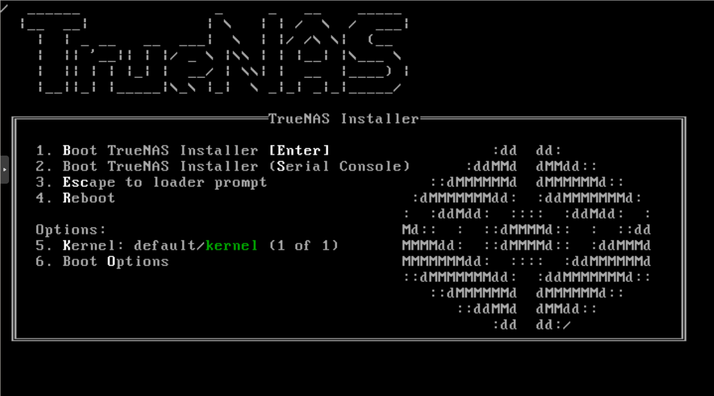
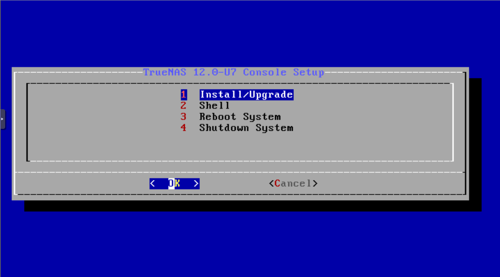
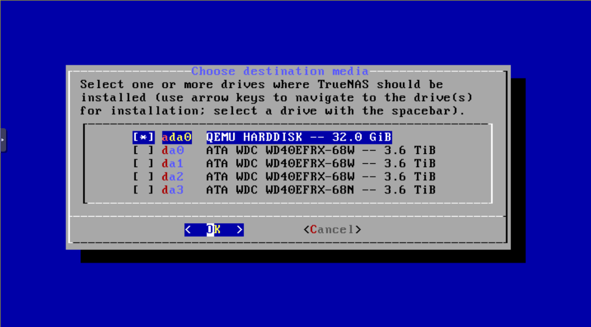
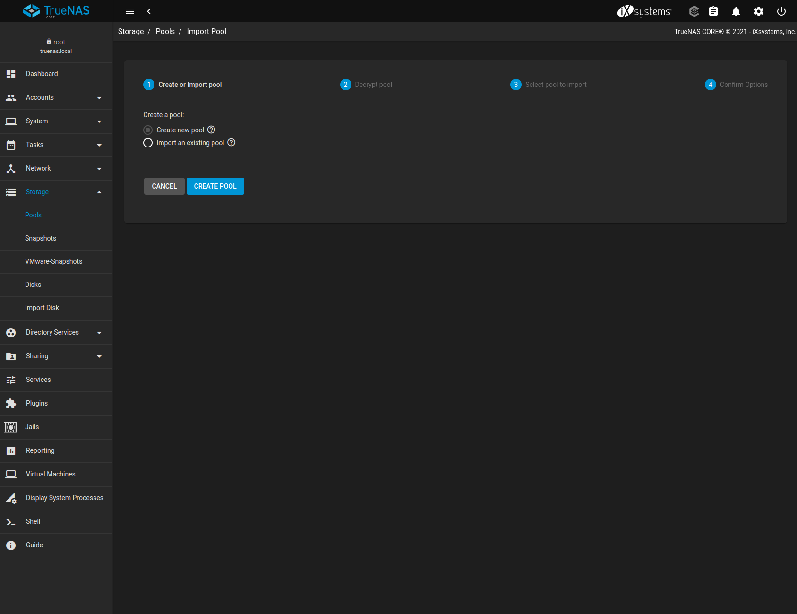
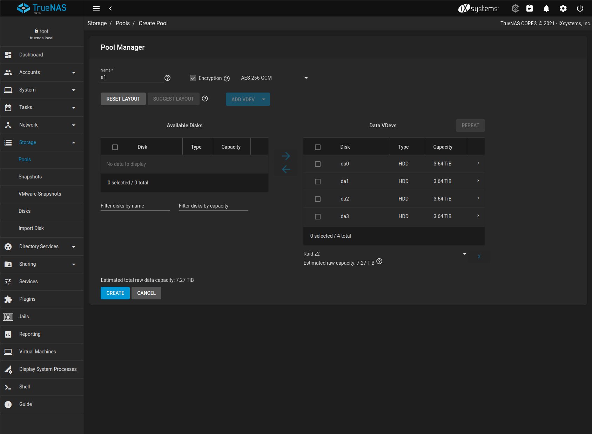
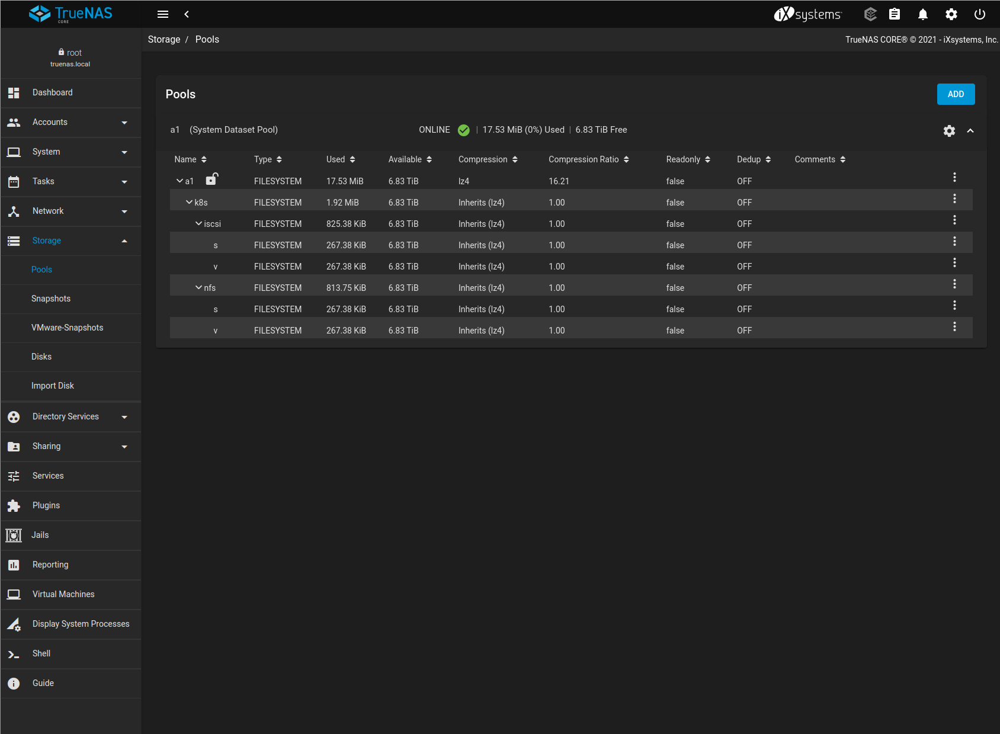
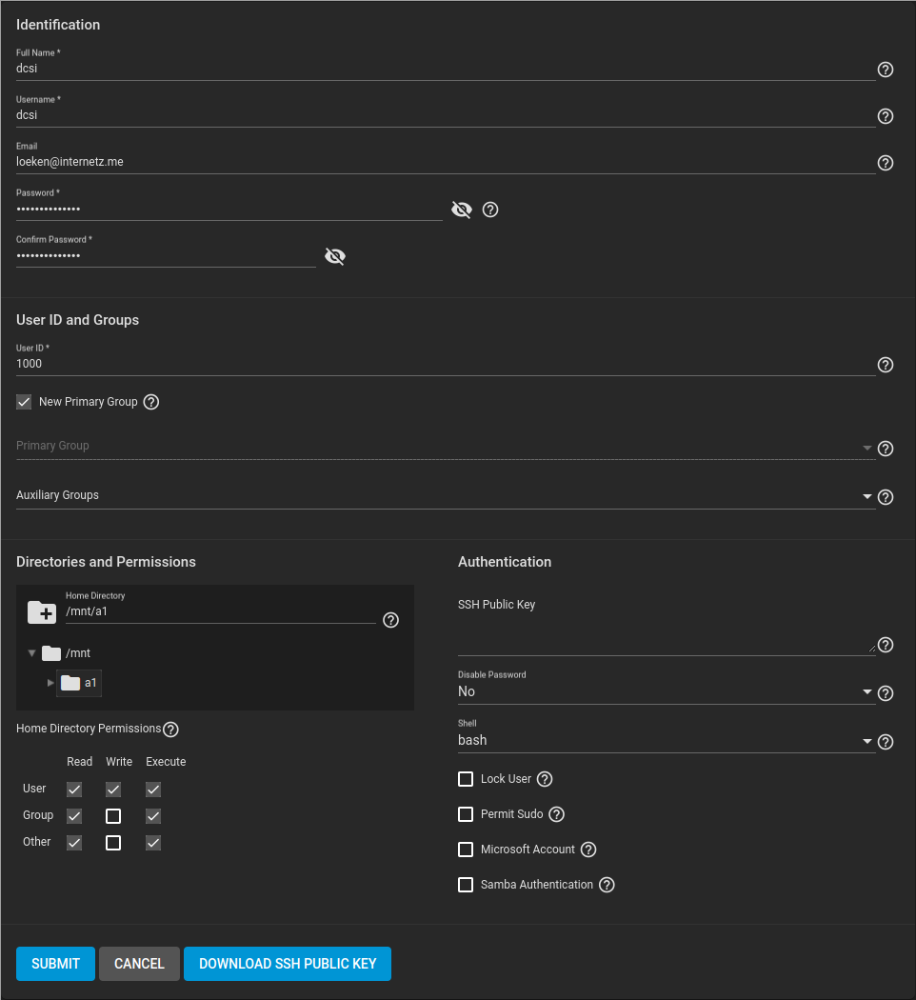
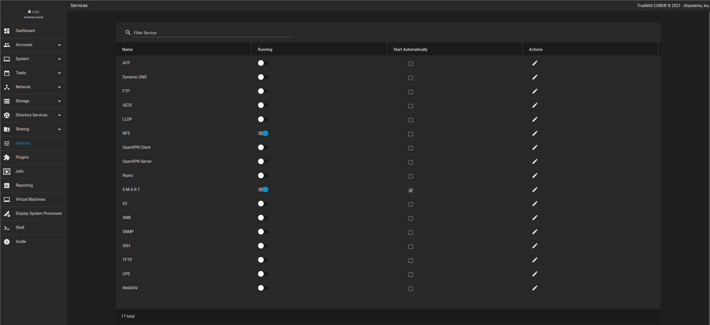
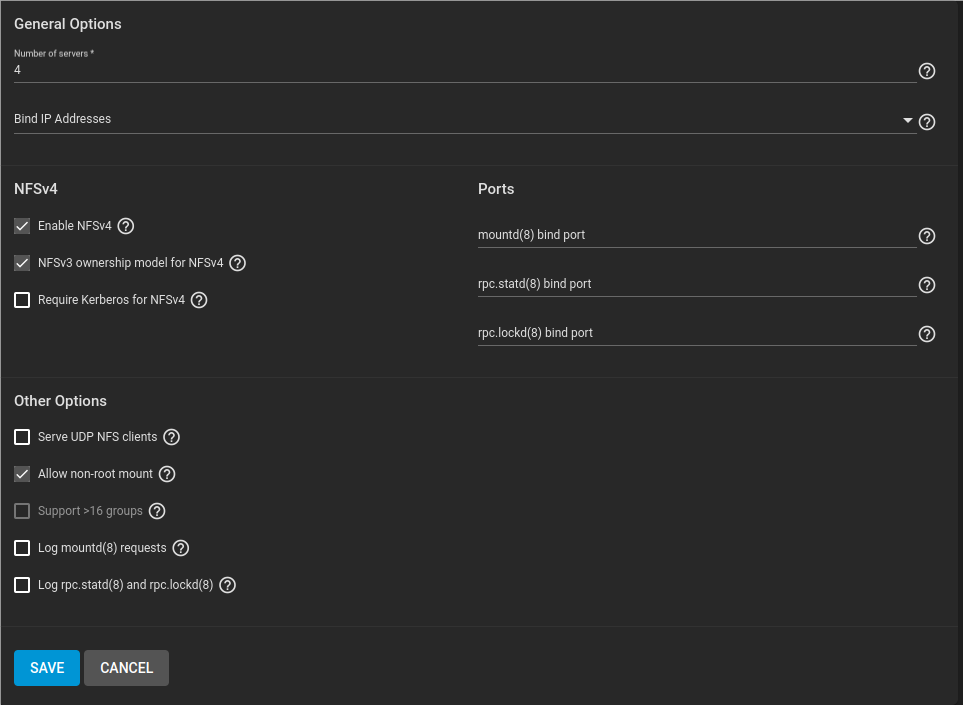
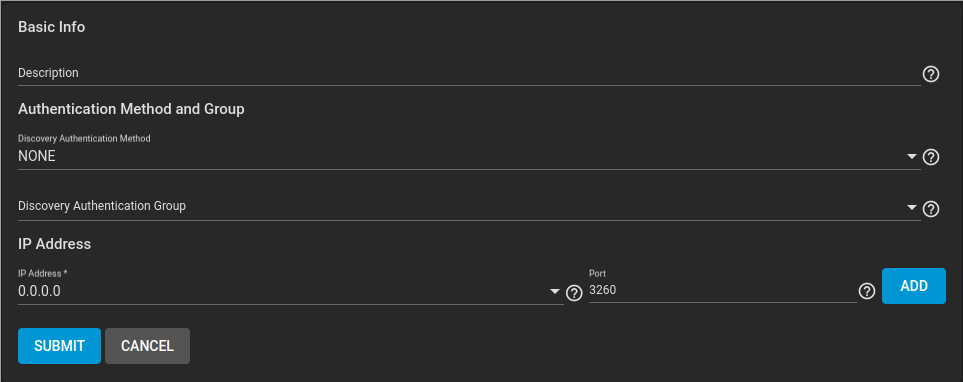

## democratic csi iscsi

#### preparation of truenas

First grab an iso from https://www.truenas.com/download-truenas-core/ and put it on a usb stick ( use dd / belena etcher )

create a kvm in proxmox ( 1GB of 1TB of storage ) mount that iso and start the installation:

select 1 to boot truenas installer



select the option to install truenas



select the virtual disk in which to install truenas



now we can login to the ui with root / password we set at the end of the install we had to the Storage > Pools section to create a new pool 



now we can give the pool a name and assign the disks to it, here i ll start out with 4 disks with 4TB each ( western digitial red ). this 16TB is bascially mirrored so we ll end up with a total storage of ~ 8TB. I'm picking the name a1 for archive1 but i want to keep it as short as possible



now that the pool exists we can create some structure in it by creating datasets. kubernetes will eventually create pvs inside this pool, v stands for volume and is where volumes will be stored and s stands for snapshots. we ll have iscsi and nfs as a storage option.



next step we ll create a user dedicated for democratic csi ( dcsi ) kubernetes will use this account to ssh into truenas. make sure to have the homedirectory set and that the shell is set to bash or sh. 

Note: you need to go to Services to enable the SSH server.

We also create a new ssh keypair 
```
❯ ssh-keygen -t rsa -b 4096
Generating public/private rsa key pair.
Enter file in which to save the key (/home/loeken/.ssh/id_rsa): id_rsa_truenas
Enter passphrase (empty for no passphrase): 
Enter same passphrase again: 
Your identification has been saved in id_rsa_truenas
Your public key has been saved in id_rsa_truenas.pub
The key fingerprint is:
SHA256:sGx+CHDuo3n6AyFvxDPRKlMq0FhZefFnY1FgI04BKcU loeken@0x00f
The key's randomart image is:
+---[RSA 4096]----+
| +.+.++++.=o.    |
|o = + E+ o o     |
|.+.o.o. o =      |
|* B+ . o + .     |
|.* +o + S        |
|  +. + .         |
| . .o o .        |
|   oo. .         |
|  ++..           |
+----[SHA256]-----+
❯ ls |grep id_rsa_truenas
id_rsa_truenas
id_rsa_truenas.pub
```

enter the contents of id_rsa_truenas.pub in the authorized_keys section of the truenas user. the private key will be used in the config of the democratic-csi argocd app.




now we can click on services in the left menu, and turn on nfs.


now click on the edit icon in the Actions column to change the settings for nfs. Enable
- Enable NFSv4
- NFSv3 ownership model for NFSv4
- Allow non-root mount.



Now in the left menu we select: Sharing > Block Shares (iSCSI)

Target Global Configuration: just click save and enable the service. you should see a popup as confirmation.

Portal Tab: click add on the top right. in this form select 0.0.0.0 as ip.




Initiators Tab: create a new one and select the checkbox at the top left to allow all.

now the last step that needs to be done is to ssh into the server and 

```
chown -R dcsi /mnt
```

since we ll connect to truenas via ssh by using the democratic-csi we ll need to have our storage owned by this user.


#### customize your settings

```
cd deploy/mysecrets/
cp argocd-democratic-csi-iscsi.yaml.example argocd-democratic-csi-iscsi.yaml
nano argocd-democratic-csi-iscsi.yaml
```

now in here change the ip 172.16.137.13 with the ip of your truenas, update the root password for truenas and insert the id_rsa_truenas private key, after that is done we can send this to kubeseal and apply the encrypted version

```
cat argocd-democratic-csi-iscsi.yaml | kubeseal | kubectl apply -f -
```